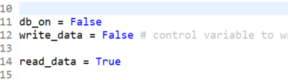
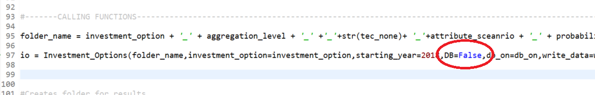
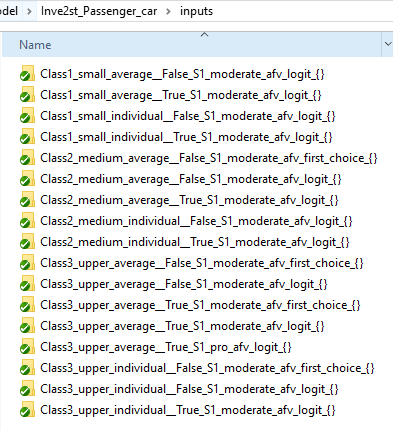
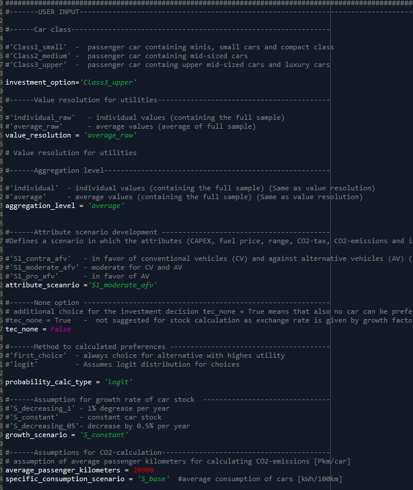
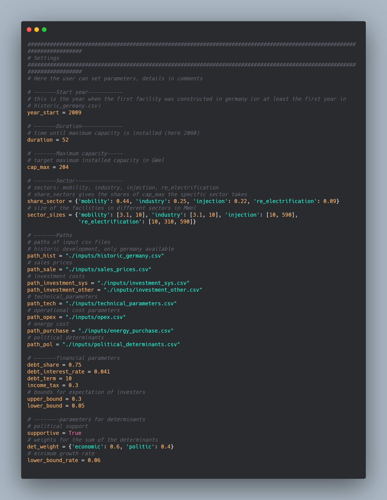

.. _quick_start:

Quick Start
=============

Installation Passenger Cars
------------------------------
Download the code from https://www.github.com

Hint: If working in Spyder IDE, please set the working directory to the root folder (Inve2st_Passenger_car).

Prerequisites
------------------------------
Please use Python 3.7. 
Following python modules are required and should be installed before running the framework.
 

	- numpy 
	- scipy
	- pandas
	- scikit-learn 
	- psycopg2 

Minimum working example Passenger Cars
------------------------------
To run the simulation for passenger cars car_simulation.py needs to be executed. 
If no own PostgreSQL Database – according to the Inve2st schema is set up, the model can be run without database – reading in csv data from the Input folder. Within the car_simulation.py the following settings need to be put to work with csv files:

   

The csv files are provided for different cases:

The options (scenarios) that are available are put as comments in the car_simulation.py  and can be replaced by the other available options(e.g. investment_option = ‘Class1_small’ can be replaced by investment_option = ‘Class2_medium’). The folder name in the input order shows which scenarios are available by default. A detailed description of the data can be found under "Data and Database". A short description of the options is provided in the code. 
In the folder inputs/scenario_data an excel sheet is provided containing attribute developments for 4 different scenarios, which can be filtered an replaced in the input/query_attribute_level_per_year.csv - if the scenario is not supplied by default. 
Ensure that the folder name is build according to the "folder_name" specification  

All user settings can be made in the car_simulation.py 

   
   
Installation Power-to-Gas
------------------------------
The tool was written in python 3.7, the used packages are listed in requirements.txt. For a meaningful package and dependency management the use of virtual environments is recommended. The installation is described when working with Anaconda. To install the program perform the following steps:

1. Download the code from https://www.github.com
2. Open Anaconda prompt
3. Create virtual environment: 'conda create -n name_of_environment python=3.7'
4. Activate virtual environment: 'conda activate name_of_environment'
5. Install required packages: 'pip install -r path/requirements.txt'
6. Don't forget to use the generated interpreter as project interpreter

A minimum working example
------------------------------
To run the model, it suffices to execute the ptg.py after the steps above. If wished, the settings can be changed in ptg.py, a picture of the settings is below, a description is in :ref:`API`.

