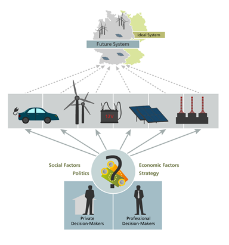

.. _the_inve2st_model:

The Inve2st Model
=================

1.    Explanation of the model
------------------------------

The framework is designed to calculate the market diffusion of energy technologies until 2050 in dependence on investment-decisions made by respective actors. The target of the model is to evaluate if future target systems can be achieved considering the investment behaviour and its influencing factors. 
The understanding of a target system is hereby a quantified energy scenario, which is based on the CO2-emission targets of the German government. 
All sectors and components within the system (generation, storage, grid) are integrated within a mathematical model, which minimizes the total system costs. 
Examples for those models are, among others, REMod  or TIMES. A meta-study of target systems can be found in (Jülch, Senkpiel, Kost, Hartmann, & Schlegl, 2018). However, there is a gap between the cost-optimal 
solutions and the real technology diffusion as the latter on depends on actual adoption or investment decisions. Those in turn are affected by the given framework conditions. The Inve2st framework 
aims to evaluate the impact of changing framework conditions on technology adoption and therewith the technology diffusion. Further it prodvides insights into factors which are important to achieve certain technology shares. 
The investment decisions differ between private and corporate decisions and also between the technologies. 

   
2.    The exemplary cases
-------------------------

Within this framework, three different technologies are modelled. 
	- alternative drive systems for passenger cars
	- PV-battery systems of private house owners
	- Power-to-Gas systems
The PV-battery systems and passenger cars focus on private investment decisions, whereas the diffusion of Power-to-Gas represents corporate investment decisions. 

The three technologies serve as exemplary cases on the following question: 

1.	Which methodology is applicable to model the diffusion of the specific technology? 
2.	What kind of data (qualitative and/or quantitative) is necessary for modelling and how can this data be empirically collected? 
3.	How can the diffusion be modelled? 
4.	How strongly do changing framework conditions influence the diffusion process?

