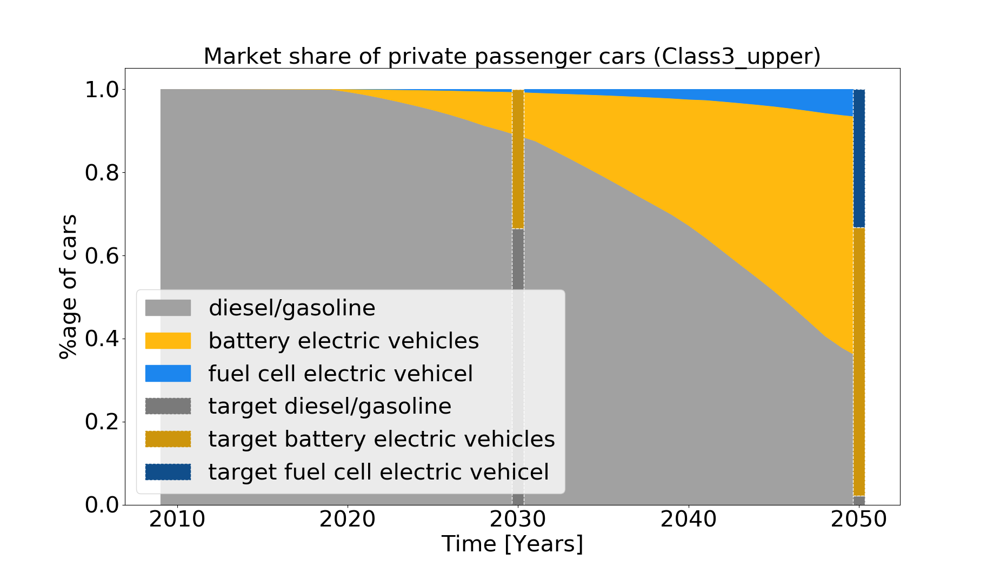

.. _use_cases_in_detail:

Use Cases In Detail
===================

This chapter describes the modelling of the adoption of
	- alternative drive systems of passenger cars
	- PV-battery systems of private house owners
	- Power-to-Gas systems

Passenger cars
------------------------------

**Introduction** 

The aim of the model is to simulate the annual adoption of alternative drive systems of passenger cars by private persons. With the model results it is possible to compare these results with the targets that originate from energy system scenarios to fulfill the necessary CO2-emission reduction targets. 

**Empirical data** 

The modelling approach follows the method of a discrete choice model using data from a representative discrete choice experiment incorporated in an online questionnaire study. The respondents had to choose among three alternative vehicle types (battery-electric (BEV), fuel cell (FCEV) and conventional (diesel/gasoline CV)), which were characterized by following attributes: 

	- CAPEX 
	- CO2-tax
	- fuel costs
	- infrastructure
	- range
	- well2well emissions

Each attribute had two to four attribute levels, which were chosen to represent the bandwidth of the development from today until 2050. The attribute levels rotated within the experiment, so that every participant responded to 10 choice tasks. As the attribute levels differ between different car classes a distinction between three classes was undertaken. 

	- Class1_small (minis, small cars and compact class)
	- Class2_medium (mid-sized cars)
	- Class3_upper  (upper-sized cars and luxury cars)

**Model process** 

For simulating the adoption 

	1. The model is initialized
	2. The utilities are calculated 
	3. The probabilities are calculated 
	4. The change in the car stock is calculated 

.. figure:: images/flow_chart_PC.png
   :align: center
   :scale: 70%

1. **Initialization** def __init__() (:ref:`API<api>`)
	- the user chooses between different car classes (Class1_small, Class2_medium, Class3_upper)
	- Data base is initialized (this is not necessary if csv data is read in (self.read_data = True))
	- The starting year is defined according to the car stock data 2018

2. **Calculate Utility** calculate_utility() (:ref:`API<api>` )

The target of this function is to calculate the total utility of possible alternatives for each respondent. All possible alternatives were created from a set of attribute levels. Via the discrete choice experiment, partial utilities of the respective attribute levels were calculated. The partial utilities were calculated with SAWTOOTH software on the basis of Hierarchical Bayes Estimation (https://www.sawtoothsoftware.com/support/technical-papers/hierarchical-bayes-estimation). The total utilties were calculated as the sum of partial utilities of each attribute level. Partial utilities were provided within the original dataset :ref:`Data and Database<data_and_data_base>` of the discrete choice experiment. 

For vehicles, the attributes are specified as a (future attribute development) scenario, in which the car attributes (capex, co2-tax, fuel costs, infrastructure, range and well2well emissions) are specified by means of the predicted? attribute levels for each year from the start_year (2018) until 2050 :ref:`Class1_small_average__False_S1_moderate_afv_logit_<Class1_small_average__False_S1_moderate_afv_logit_{}>` . By adapting the attribute levels the user can create a new scenario for simulating different technology deployments. As a result, the influence of changing parameters (for example good infrastructure for battery electric vehicles) on the investment decision of alternative vehicle types can be modelled. For a proper functioning of the model ?? it needs to be ensured, that the attribute levels are within the minimum and maximum value of the DCE values. Interpolations of continuous values are possible, extrapolations are not valid. 
For the discrete attributes (CO2-tax, infrastructure and wel2whell emissions) the partial utilities are directly used from the data set whereas for the continuous attributes (CAPEX, fuel cost, range)
the values of the partial utilities are interpolated linearly between two data points.  

One option that can be chosen in the car_simulation.py is the inclusion of the NONE option. This operation is only recommended for the calculation of the preference shares but not for the stock model, in which an assumption of the development of the cumulated car stock (as a percentage) can be set as an input parameter. 
The input data needed as csv or data base query are: 

	1. alternatives :ref:`Class1_small_average__False_S1_moderate_afv_logit_<Class1_small_average__False_S1_moderate_afv_logit_{}>`
	2. query_attribute_level_putility (partial utilities from original dataset)
	3. query_utility_none_option (partial utility of none option if enabled)
	4. query_attribute_level_per_year (scenario definition from today until 2050 (e.g.attribute_scenanrio ='S1_moderate_afv'))

As a result of the function a pandas.dataframe (utilities_alternatives) is generated. The probability is not calculated in this step (-1 serves as a placeholder). The usage of the average utilities is not recommended, as the results differ distinctly from the usage of the individual utilities. The value resolution and aggregation *average* is recommended to use for the understanding and further development of the model, as the simulation is much faster than for individual values. 

.. figure:: images/utilities_alternatives.png
   :align: center
   :scale: 70%

3. **Calculate Choice Probability** 
On the basis of the total utilities per alternative per respondent, the preference share for one alternative compared to the other alternatives is calculated. For this purpose, different logics can be applied. One of them needs to be chosen in the car_simulation.py *(probability_calc_type = 'logit').*

	**First choice** calculate_first_choice() (:ref:`API<api>` )

The assumption of this rule is that the respondent chooses the alternative with the highest utility.

	**Logit choice probability** calculate_logit_probabilities() (:ref:`API<api>` )

Within this rule a share of preference towards each alternative is calculated per respondent. Following the equation: 

.. figure:: images/equation_logit_prob.png
   :align: center
   :scale: 50%
Where i is individual, j is alternative, U is utility and P is the probability

The input data needed as csv or data base query are for both rules: 

	1. utility_alternatives (result from calculate_utility())
	2. main_sub (main_sub = {} (no building of subgroups))
*Explanation main_sub: represents a subgroup of the respondents; for example only selecting the respondents that stated to be female for analyzing the influence of person-related factors. Note: The specification only works with database connection. If no connection to the database exists a subgroup of respondents can be manually built in the csv file df_sub.*

As a result of one of the decision rules a pandas data frame *tb_prob_alternatives* is passed and saved (results/tb_prob_alternatives.csv). In addition, a graph with the preference shares is saved (/results/preference_share.png).

.. figure:: images/preference_share.png
   :align: center
   :scale: 40% 

4. **Stock model** stock_model()(:ref:`API<api>` )

Aim of the stock model is the calculation of the **total car stock by vehicle type** (BEV, FCEV, CV) from 2018 until 2050, on the basis of the preference shares of the individuals. 
For this purpose, an assumption on the development of the total car stock as a yearly percentage (e.g. growth_scenario = 'S_constant') is made to calculate the total number of cars in the next year (stock_sum table), on an annual basis. Additionally, the number of cars that will be deregistered in the actual year is calculated dependent on the age of a car (car_stock table) by vehicle type. To calculate the outage probabilities a Weibull Fit is used on the basis of the historic car stock development (tb_stock) from 2001 to 2018. Having the number of new total car stock for the next year and the outages in the current year, the total number of new cars is calculated. The distribution of the new cars per vehicle type is calculated using the preference shares, that are calculated in either calculate_first_choice() or calculate_logit_probabilities(). The process is repeated sequentially until 2050 on an annual basis. 
As a result, the csv File stock_sum  is saved in the results folder. In addition, the plot stock.png is created and saved.

   
A comparison of the calculated diffusion of alternative driving concepts with shares from cost-minimizing, model-based quantified sector-coupled energy scenarios (e.g. REMod), which include a CO2-emission reduction target is realized on the basis of technology shares. It is plotted and saved in plot share.png and a statement is put in the command prompt : 

*"In 2030, the market share of battery electric vehicles (BV) is 11.46 %. The target of 33.51 % is not achieved
In 2030, the market share of fuel cell electric vehicles (FCEV) is 0.81 %. The target of 0.00 % is achieved
In 2050, the market share of battery electric vehicles (BV) is 57.78 %. The target of 64.52 % is not achieved
In 2050, the market share of fuel cell electric vehicles (FCEV) is 6.76 %. The target of 33.29 % is not achieved"*

In addition, the **CO2-emissions** based on assummed passenger kilometers (which is specified in car_simulation.py - e.g average_passenger_kilometers = 20900) are estimated per passenger car and specific emission values. 
For the calculation of emissions of conventional vehicles, emissions (according to Agora and own assumptions) are calibrated based on the total Pkm in 2018 (source:” Destatis Verkehr in Zahlen”)  and 70% (according to Renewbility III) of the total emissions from road transport (UBA) for passenger cars, compared to freight transport. Historic and future specific emissions per construction year and vehicle class are taken as data basis.  For calculating emissions of BEV and FCEV assumptions on the specific consumption (kWh/100km) as well as CO2-emissions of the electricity mix [gCO2/kWh]are used to calculate the CO2-emissions. 

*It has to be mentioned that the specific emissions from literature are much higher than the calibrated values, which shows that uncertainties arise from 1) specific emission values and 2) average driving performance. To adequately calculate the emissions a more detailed model (like TREMOD), which addresses relations between car classes, and driving performance, in terms of road usage, shares of innercity drives, highway drives, overland drives,  and further factors would be needed.*
A plot of theCO2-emissions (CO2_emissions.png) which shows the total estimated CO2-emissions until 2050 is saved. A prompt *”The proportional CO2-emission reduction target of 40-42% in 2030 compared to 1990 in the transport sector is not achieved, as a remaining share of 70% is estimated for 2030 and 40% for 2050” is printed in the console."* 

2.    PV-homestorage systems
------------------------------

Work in progress

3.    Power-to-Gas
------------------------------

Work in progress